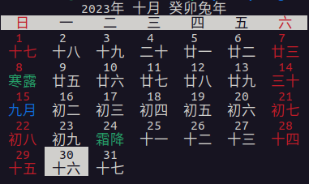

# Nongli: A Rust library and CLI tool for Chinese calendar
[](https://github.com/supertsy5/nongli)
[](https://crates.io/crates/nongli)
[](https://docs.rs/nongli)
[](https://github.com/supertsy5/nongli/blob/main/LICENSE)


Note: This project is in early development and not guaranteed to run on every platform.
Bug reports are welcome.
## Install (as an executable)
```sh
cargo install nongli --features=clap,cli
```
or
```sh
cargo install --git https://github.com/supertsy5/nongli --features=clap,cli
```
## As a library
Talk is cheap, let me show the code.
```rust
fn test() {
    use chrono::NaiveDate;
    use nongli::{ChineseDate, SolarTerm};
    let date = NaiveDate::from_ymd_opt(2023, 10, 30).unwrap();
    let chinese_date = ChineseDate::new(2023, 09, false, 16).unwrap();
    assert_eq!(ChineseDate::from_gregorian(&date), Some(chinese_date));
    assert_eq!(chinese_date.to_gregorian(), date);
    assert_eq!(
        SolarTerm::from_date(&NaiveDate::from_ymd_opt(2023, 10, 25).unwrap()),
        Some(SolarTerm::Shuangjiang)
    );
}
```

## Development
Tip: run
```sh
. aliases.sh
```
for common aliases.

Clone this repository and run:
```sh
cargo build
```